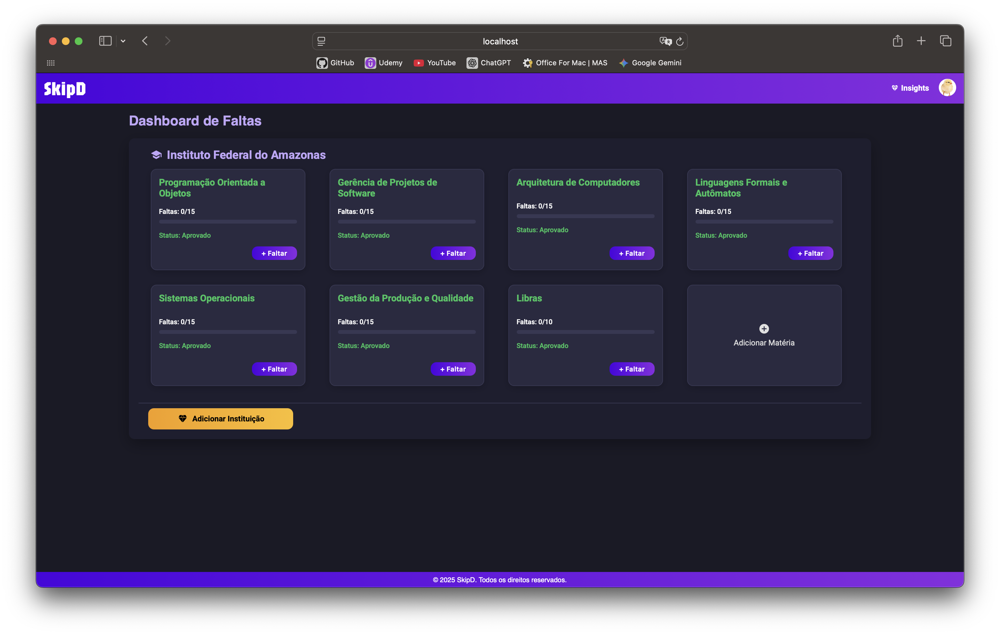
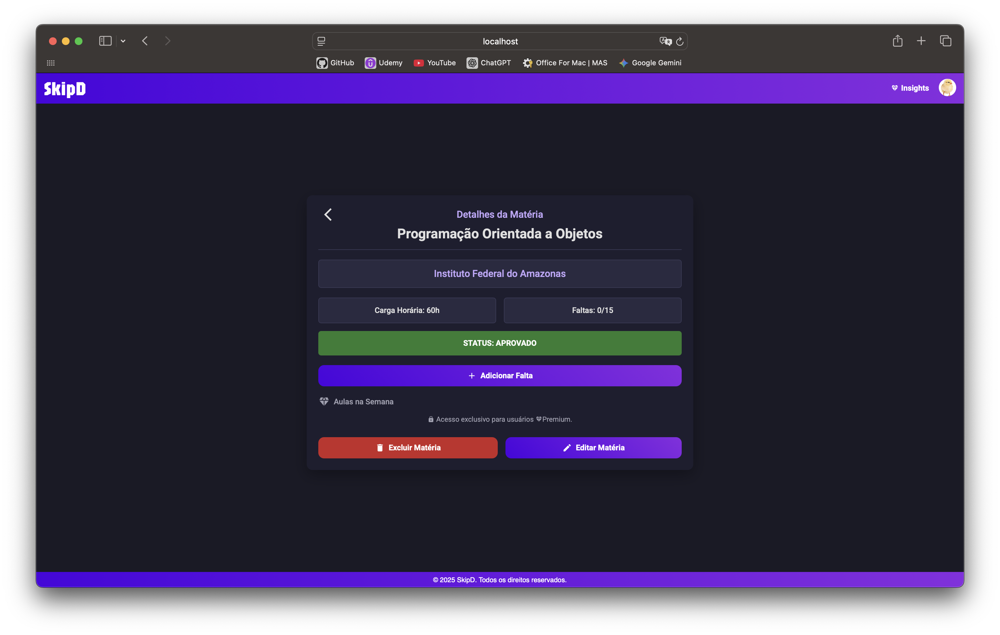
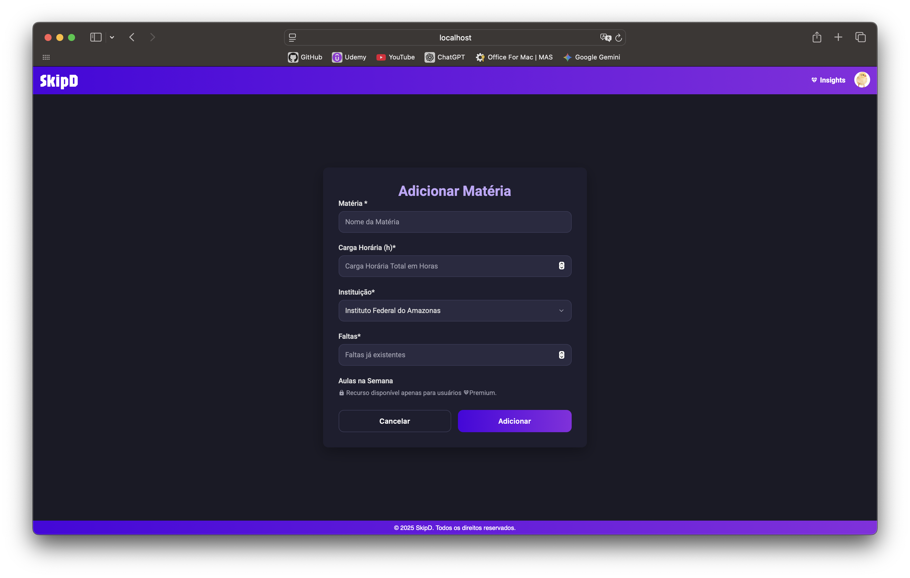
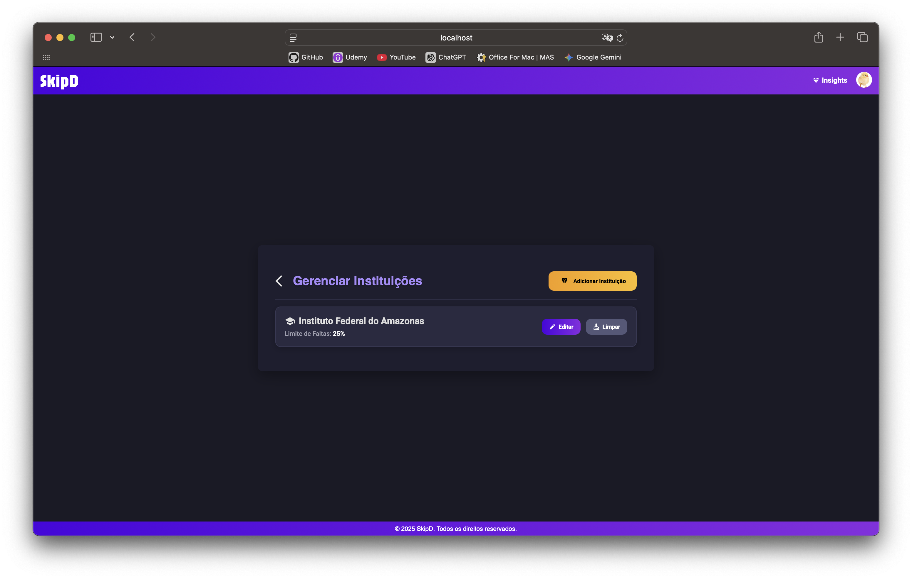
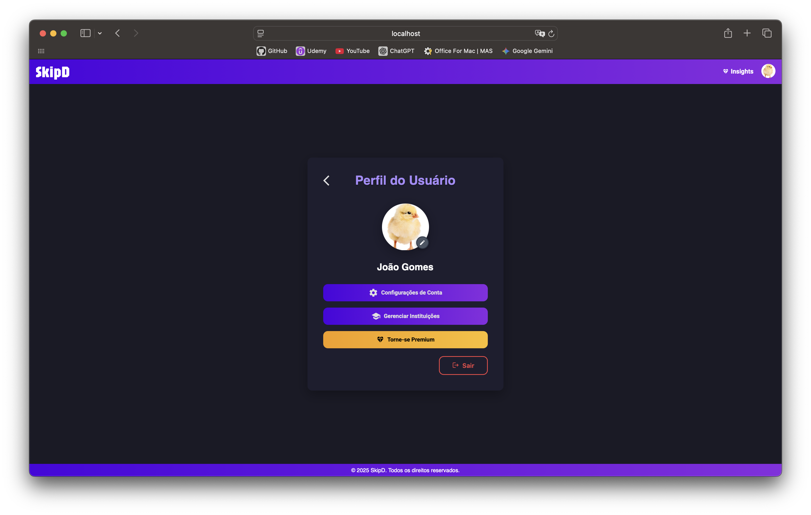
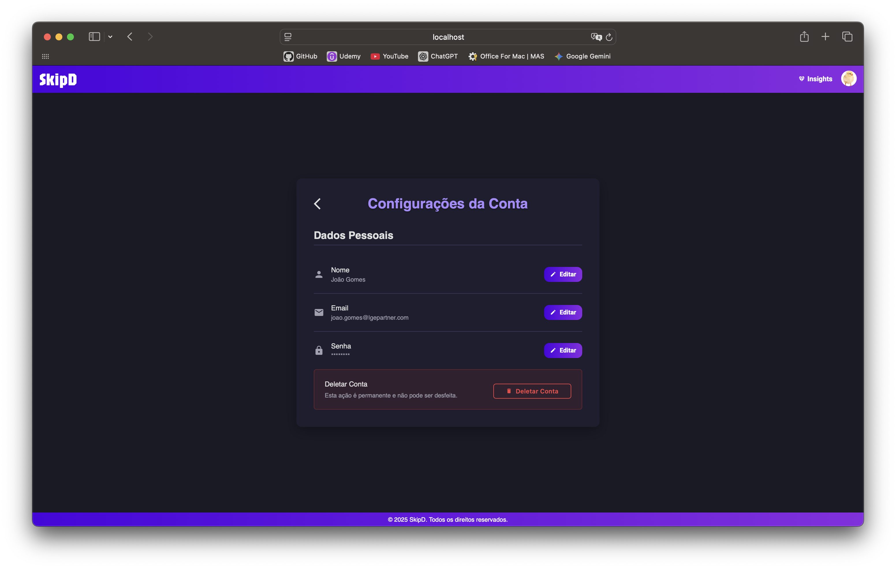

#  SkipD - Sistema de Controle de Frequência Acadêmica

O **SkipD** é uma aplicação web moderna e intuitiva desenvolvida em Angular para ajudar estudantes a gerenciar sua frequência escolar e acadêmica de forma eficiente. Com o SkipD, você pode acompanhar suas faltas, monitorar seu status em cada matéria e evitar reprovações por frequência.

## 🚀 Funcionalidades

### 📊 **Gestão de Frequência**

- Controle de faltas por matéria
- Cálculo automático do status (Aprovado/Risco/Reprovado)
- Visualização do percentual de faltas em tempo real
- Limite personalizado de faltas por instituição

### 🏫 **Gerenciamento de Instituições**

- Cadastro e edição de instituições de ensino
- Configuração de limite de faltas específico por instituição
- Múltiplas instituições por usuário

### 📖 **Controle de Matérias**

- Cadastro completo de matérias com carga horária
- Edição e exclusão de matérias
- Visualização detalhada por matéria
- Histórico de faltas

### 👤 **Sistema de Usuários**

- Cadastro e autenticação segura
- Perfil personalizado do usuário
- Configurações de conta

### 🎯 **Recursos Premium**

- Cronograma semanal de aulas
- Planejamento de horários por dia da semana
- Recursos avançados de visualização

## 🛠️ Tecnologias Utilizadas

- **Frontend**: Angular 20+ com TypeScript
- **UI/UX**: Angular Material Design
- **Estilização**: SCSS com design responsivo
- **Arquitetura**: Componentes modulares e serviços injetáveis
- **Guards**: Proteção de rotas e controle de acesso
- **Interceptors**: Gerenciamento de requisições HTTP

## 📁 Estrutura do Projeto

```
src/
├── app/
│   ├── components/          # Componentes da aplicação
│   │   ├── pages/          # Páginas principais
│   │   └── shared/         # Componentes compartilhados
│   ├── guards/             # Guards de proteção de rotas
│   ├── interceptors/       # Interceptors HTTP
│   ├── models/             # Interfaces e modelos de dados
│   ├── services/           # Serviços da aplicação
│   └── routes/             # Configuração de rotas
├── environments/           # Configurações de ambiente
└── styles.scss            # Estilos globais
```
## 📱 Funcionalidades por Tela

### 🏠 **Tela Inicial (Home)**

- Visualização de todas as matérias por instituição
- Cards informativos com status visual
- Adição rápida de faltas
- Navegação para detalhes das matérias



### 📋 **Detalhes da Matéria**

- Informações completas da matéria
- Histórico de faltas
- Cronograma semanal (Premium)
- Opções de edição e exclusão



### ➕ **Cadastro de Matérias**

- Formulário completo com validações
- Seleção de instituição
- Configuração de cronograma semanal (Premium)
- Cálculo automático de carga horária



### 🏫 **Gerenciamento de Instituições**

- Lista de todas as instituições do usuário
- Edição de configurações
- Exclusão com limpeza de matérias associadas



### 👤 **Configurações de Conta**

- Edição de dados pessoais
- Alteração de senha
- Configurações de preferências




## 🎨 Design e UX

O SkipD foi desenvolvido com foco na experiência do usuário, apresentando:

- Interface limpa e moderna
- Design responsivo para todos os dispositivos
- Feedback visual claro para diferentes status
- Navegação intuitiva
- Tema consistente com a identidade visual

## 🔒 Segurança

- Autenticação segura de usuários
- Guards de proteção de rotas
- Validação de formulários
- Interceptors para gerenciamento de requisições

## 🚀 Próximas Funcionalidades

- [ ] Notificações push para avisos de faltas
- [ ] Relatórios de frequência
- [ ] Sincronização com calendários
- [ ] Modo escuro
- [ ] Exportação de dados

## 👥 Contribuição

Contribuições são bem-vindas! Sinta-se à vontade para:

- Reportar bugs
- Sugerir novas funcionalidades
- Enviar pull requests
- Melhorar a documentação

## 📄 Licença

Este projeto está sob a licença MIT. Veja o arquivo `LICENSE` para mais detalhes.

## 🤝 Suporte

Se você encontrar algum problema ou tiver dúvidas, abra uma issue no repositório ou entre em contato com a equipe de desenvolvimento.

---

**Desenvolvido com ❤️ para ajudar estudantes a manterem o controle de sua frequência acadêmica.**
